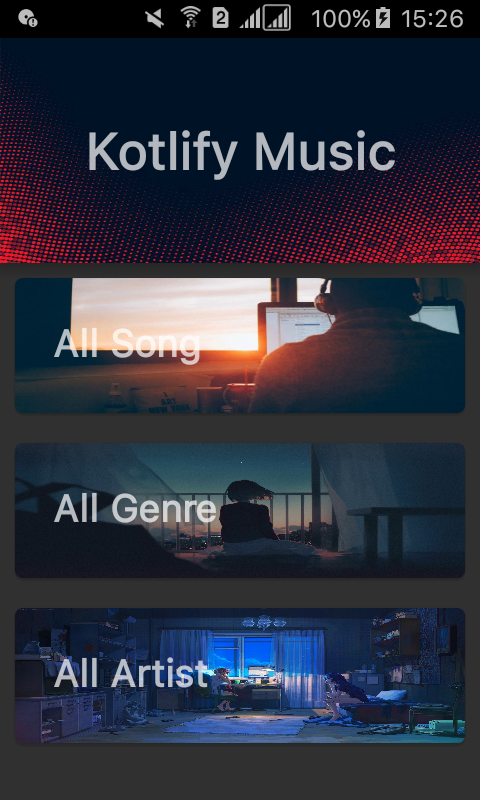
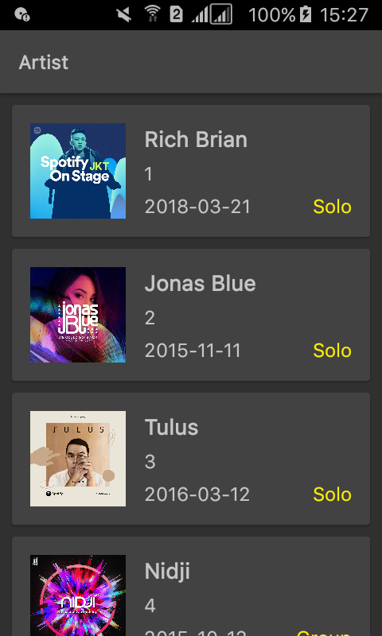
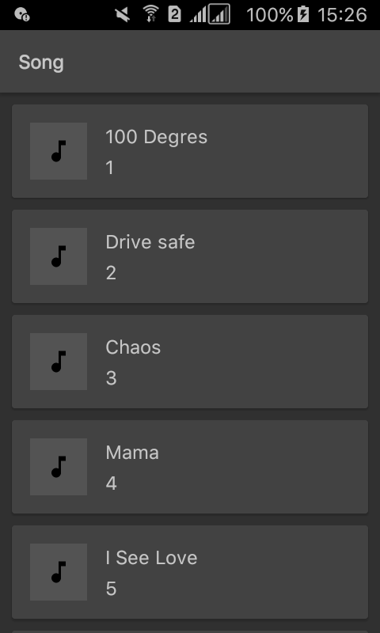
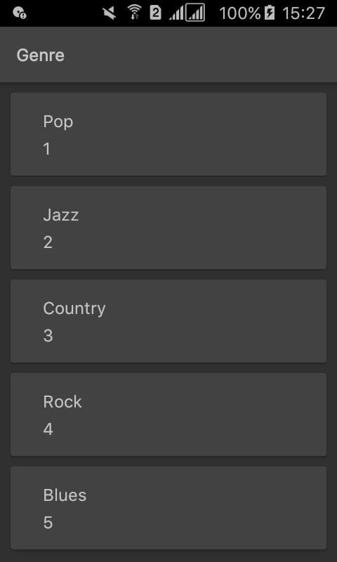

# Kotlify API

## Application Screenshot

## Use API

### Get All Artist

| Method | URL |
| ------ | --- |
| `GET` | `http://localhost:8080/artist` |

### Get All Song

| Method | URL |
| ------ | --- |
| `GET` | `http://localhost:8080/song` |

### Get All Genre

| Method | URL |
| ------ | --- |
| `GET` | `http://localhost:8080/genre` |

### Get All Song By Artist ID

| Method | URL |
| ------ | --- |
| `GET` | `http://localhost:8080/song/artist/{id}` |

### Get All Song By Genre ID

| Method | URL |
| ------ | --- |
| `GET` | `http://localhost:8080/song/genre/{id}` |
